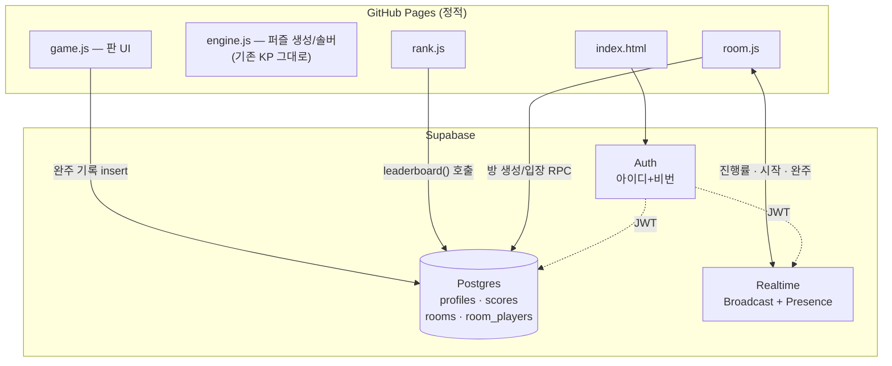
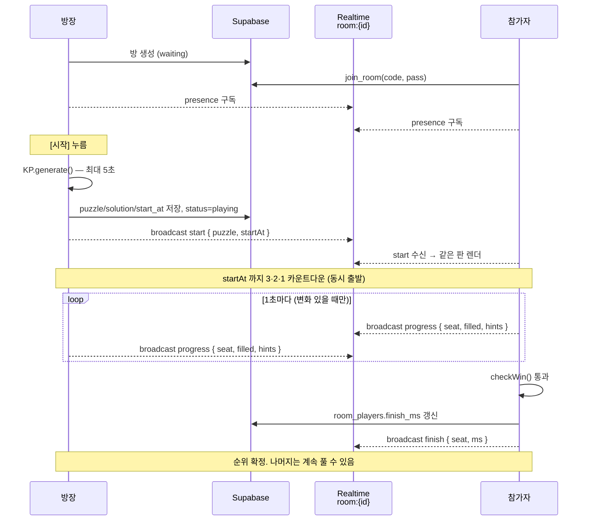

# 나이트 부대 배치 — 온라인화 설계

현재 `knight-troop-puzzle.html` (963줄, 단일 파일)을 기준으로
힌트 제한 · 로그인 · 랭킹 · 대전을 얹어 웹에 배포하기 위한 설계서.

---

## 1. 결론: 기술스택

| 층 | 선택 | 비용 |
|---|---|---|
| 호스팅 | **GitHub Pages** (`minsungchu/knight-troop-puzzle`, `main` 브랜치) | 무료 |
| 인증 | **Supabase Auth** (아이디+비밀번호) | 무료 |
| 데이터베이스 | **Supabase Postgres** + RLS | 무료 |
| 실시간 대전 | **Supabase Realtime** (Broadcast + Presence) | 무료 |
| 프런트엔드 | 순수 HTML/CSS/ES Modules — **빌드 도구 없음** | — |

배포 주소: `https://minsungchu.github.io/knight-troop-puzzle/`

### GitHub만으로 안 되는 이유

GitHub Pages는 **정적 파일 서버**입니다. 서버에서 코드를 실행할 수 없고 데이터베이스도 없습니다.

- 힌트 5회 제한 → GitHub만으로 **가능** (클라이언트 로직)
- 로그인 → 비밀번호를 검증할 서버가 없어 **불가능**
- 랭킹 → 여러 사람의 기록을 모아둘 곳이 없어 **불가능**
- 대전 → 플레이어 간 실시간 통신 경로가 없어 **불가능**

GitHub Actions는 커밋 트리거로만 도는 배치 작업이라 요청-응답 서버가 될 수 없고,
Issues/Gist API를 DB처럼 쓰는 편법은 쓰기 권한 토큰을 브라우저에 노출해야 하며 실시간도 안 됩니다.

### 왜 Supabase인가

- **추가되는 외부 서비스가 하나뿐** — 인증·DB·실시간이 한 대시보드에 다 있음
- 브라우저에서 `import` 한 줄로 붙음. npm/webpack/Vite 전부 불필요
- 실시간 대전에 필요한 WebSocket 브로드캐스트를 기본 제공
- Row Level Security로 "본인 기록만 등록 가능" 같은 규칙을 DB가 강제

> 대안: Firebase도 거의 동등하나 랭킹 쿼리(사용자별 최고기록 정렬)가 Firestore에서 더 번거롭습니다.
> Cloudflare Pages + D1 + Durable Objects는 더 저렴하지만 실시간 방 로직을 직접 작성해야 합니다.

---

## 2. 확정된 정책

| 항목 | 결정 |
|---|---|
| 힌트 카운트 | 새 칸을 짚어주는 **첫 누름만 1회**. 같은 칸의 "근거 보기" 재열람은 무료 |
| 힌트 ↔ 랭킹 | 힌트를 **1회라도 쓰면 랭킹 미등록** (개인 기록으로는 저장) |
| 랭킹 보드 | **정사각 프리셋만** — 6×6 / 8×8 / 10×10 / 12×12 × 난이도 3종 = 12개 보드 |
| 대전 관전 | **진행률 숫자/게이지만** 공유 (판 내용은 절대 전송 안 함) |
| 비로그인 | 혼자 플레이 **가능**. 랭킹 등록·대전 참가만 로그인 필요 |
| 비밀번호 찾기 | **없음** (이메일 미수집). 분실 시 새 계정 안내 |
| 동시접속 | 한 계정당 **1곳** — 나중 로그인이 이전 세션을 밀어냄 |

---

## 3. 아키텍처



**핵심 원칙**: 퍼즐 생성·검증·솔버는 전부 브라우저에서 돕니다. 서버는 계정·기록·중계만 담당합니다.
기존 `KP` 엔진은 **한 줄도 고치지 않고** `export` 만 붙여 그대로 씁니다.

### 공개 키에 대해

`SUPABASE_ANON_KEY`는 저장소에 그대로 커밋합니다. 이 키는 원래 공개용이며,
실제 권한은 RLS 정책이 결정합니다. `service_role` 키는 **절대** 클라이언트에 넣지 않습니다.

---

## 4. 파일 구조

현재 963줄 단일 파일이 대략 2,500줄로 늘어나므로 ES Modules로 나눕니다.

```
/
├── index.html               # 셸: 헤더 · 탭 · 모달 컨테이너
├── css/
│   ├── theme.css            # 기존 :root 토큰 (놋쇠/양피지/심야 남색)
│   ├── board.css            # 기존 3D 판 스타일 그대로
│   └── app.css              # 로그인 · 랭킹 · 대전 신규 UI
├── js/
│   ├── engine.js            # 기존 KP IIFE → export default KP
│   ├── game.js              # 기존 두 번째 IIFE → 판 UI + 힌트 제한
│   ├── supabase.js          # createClient + 세션 관리 + 동시접속 감시
│   ├── auth.js              # 가입/로그인 폼 + 검증
│   ├── rank.js              # 랭킹 탭
│   ├── room.js              # 대전 로비 + 방
│   └── ui.js                # toast · veil · 탭 전환 (기존 함수 추출)
├── knight-troop-puzzle.html # 기존 단일 파일 — 오프라인용으로 보존
├── supabase/schema.sql      # DB 스키마 (아래 5장 전문)
└── DESIGN.md
```

**주의**: ES Modules는 `file://`에서 열리지 않습니다. 로컬 확인은 `npx serve .` 또는
`python3 -m http.server` 로 띄운 뒤 `localhost`로 접속해야 합니다.

**게임 로직 변경 없음**: `game.js`는 기존 코드를 그대로 옮기고 다음만 추가합니다.
- `S.hints` 카운터
- 완주 시 랭킹 제출 훅
- 대전 모드일 때 진행률 브로드캐스트 훅

---

## 5. 데이터 모델

```sql
-- ══════════════════════════════════════════════
-- 프로필
-- ══════════════════════════════════════════════
create table public.profiles (
  id            uuid primary key references auth.users(id) on delete cascade,
  username      text not null unique,
  session_token uuid,                          -- 동시접속 1곳 제한용
  created_at    timestamptz not null default now(),
  constraint username_format check (username ~ '^[a-z0-9_]{3,16}$')
);
alter table public.profiles enable row level security;
create policy p_read   on public.profiles for select using (true);
create policy p_update on public.profiles for update using (auth.uid() = id);

-- 가입 시 프로필 자동 생성
create function public.handle_new_user() returns trigger
language plpgsql security definer set search_path = '' as $$
begin
  insert into public.profiles (id, username)
  values (new.id, lower(new.raw_user_meta_data->>'username'));
  return new;
end $$;

create trigger on_auth_user_created after insert on auth.users
  for each row execute function public.handle_new_user();


-- ══════════════════════════════════════════════
-- 랭킹 기록
-- ══════════════════════════════════════════════
create table public.scores (
  id         bigint generated always as identity primary key,
  user_id    uuid not null references public.profiles(id) on delete cascade,
  username   text not null,                    -- 비정규화: 조회 단순화
  size       smallint not null,                -- 6 / 8 / 10 / 12
  level      smallint not null check (level between 1 and 3),
  ms         integer  not null check (ms > 0),
  hints_used smallint not null default 0,
  room_id    uuid,                             -- 대전에서 나온 기록이면 방 id
  created_at timestamptz not null default now()
);
create index scores_board_idx on public.scores (size, level, ms) where hints_used = 0;
create index scores_mine_idx  on public.scores (user_id, created_at desc);

alter table public.scores enable row level security;
create policy s_read on public.scores for select using (true);
create policy s_insert on public.scores for insert with check (auth.uid() = user_id);
-- update / delete 정책 없음 → 등록 후 아무도 손댈 수 없음

-- 보드별 랭킹 = 사용자별 최고기록 1건씩만 정렬
create function public.leaderboard(p_size int, p_level int, p_limit int default 100)
returns table (rank bigint, username text, ms int, created_at timestamptz)
language sql stable as $$
  select row_number() over (order by t.ms), t.username, t.ms, t.created_at
  from (
    select distinct on (s.user_id) s.user_id, s.username, s.ms, s.created_at
    from public.scores s
    where s.size = p_size and s.level = p_level and s.hints_used = 0
    order by s.user_id, s.ms asc, s.created_at asc
  ) t
  order by t.ms asc
  limit p_limit;
$$;


-- ══════════════════════════════════════════════
-- 대전 방
-- ══════════════════════════════════════════════
create table public.rooms (
  id          uuid primary key default gen_random_uuid(),
  code        text not null unique,            -- 6자리 입장 코드 (예: K7QM2X)
  host_id     uuid not null references public.profiles(id) on delete cascade,
  title       text not null default '',
  is_private  boolean not null default false,
  join_code   text,                            -- 비밀방 암호 (평문 — 보안 불필요)
  max_players smallint not null check (max_players between 1 and 4),
  size        smallint not null,
  level       smallint not null,
  status      text not null default 'waiting'
              check (status in ('waiting','playing','finished')),
  puzzle      text,                            -- 시작 시 확정. 0~4 숫자 문자열
  solution    text,
  start_at    timestamptz,                     -- 동시 출발 시각
  created_at  timestamptz not null default now()
);

create table public.room_players (
  room_id     uuid not null references public.rooms(id) on delete cascade,
  user_id     uuid not null references public.profiles(id) on delete cascade,
  username    text not null,
  seat        smallint not null,
  filled      smallint not null default 0,     -- 채운 칸 수 (진행률 스냅샷)
  hints_used  smallint not null default 0,
  finish_ms   integer,
  finished_at timestamptz,
  joined_at   timestamptz not null default now(),
  primary key (room_id, user_id)
);

-- join_code 가 새 나가지 않도록 rooms 직접 조회는 막고 뷰만 공개
alter table public.rooms enable row level security;
alter table public.room_players enable row level security;

create view public.open_rooms as
  select r.id, r.code, r.title, r.is_private, r.max_players,
         r.size, r.level, r.status, r.created_at,
         p.username as host,
         (select count(*) from public.room_players rp where rp.room_id = r.id) as players
  from public.rooms r
  join public.profiles p on p.id = r.host_id
  where r.status = 'waiting'
    and r.created_at > now() - interval '2 hours';   -- 유령 방 자동 소멸

-- 입장: 정원·암호·상태 검증을 서버에서
create function public.join_room(p_code text, p_pass text default null)
returns uuid language plpgsql security definer set search_path = '' as $$
declare r public.rooms; n int; me uuid := auth.uid();
begin
  if me is null then raise exception '로그인이 필요합니다'; end if;
  select * into r from public.rooms where code = upper(p_code);
  if not found then raise exception '방을 찾을 수 없습니다'; end if;
  if r.status <> 'waiting' then raise exception '이미 시작된 방입니다'; end if;
  if r.is_private and coalesce(r.join_code,'') <> coalesce(p_pass,'') then
    raise exception '입장 암호가 틀렸습니다'; end if;
  select count(*) into n from public.room_players where room_id = r.id;
  if n >= r.max_players then raise exception '정원이 찼습니다'; end if;
  insert into public.room_players (room_id, user_id, username, seat)
  select r.id, me, p.username, n from public.profiles p where p.id = me
  on conflict (room_id, user_id) do nothing;
  return r.id;
end $$;
```

**퍼즐 직렬화**: `values`/`solution` 배열을 그대로 숫자 문자열로. 12×12여도 144자.
기존 `save()` 함수의 `enc()` 방식과 동일합니다.

---

## 6. 로그인 설계

### 아이디 → 이메일 매핑

Supabase Auth는 이메일 기반입니다. 이메일을 받지 않기로 했으므로 내부에서만 합성합니다.

```js
const toEmail = (id) => `${id.toLowerCase()}@users.knight-puzzle.app`;
```

사용자에게는 이메일이 전혀 노출되지 않습니다. 대시보드에서 **Confirm email 을 반드시 끕니다**
(켜져 있으면 존재하지 않는 주소로 확인 메일이 나가고 가입이 완료되지 않습니다).

비밀번호 해싱·세션·JWT는 Supabase가 처리하므로 직접 구현하지 않습니다.

### 등록 시 검증

| 항목 | 규칙 | 메시지 |
|---|---|---|
| 아이디 | 3~16자, 영소문자·숫자·`_` 만 | "아이디는 3~16자의 영문 소문자·숫자·밑줄만 쓸 수 있습니다" |
| 아이디 | 예약어 차단 (`admin`, `root`, `guest`, `system`) | "쓸 수 없는 아이디입니다" |
| 아이디 | 중복 (DB unique) | "이미 있는 아이디입니다" |
| 비밀번호 | 8~64자 | "비밀번호는 8자 이상이어야 합니다" |
| 비밀번호 | 영문·숫자 각 1자 이상 | "영문과 숫자를 모두 넣어 주세요" |
| 비밀번호 | 아이디와 동일 불가 | "아이디와 다른 비밀번호를 쓰세요" |
| 비밀번호 확인 | 일치 | "비밀번호가 서로 다릅니다" |

클라이언트에서 즉시 검증하고, 아이디 형식은 `profiles`의 CHECK 제약이 DB에서도 강제합니다.

가입 화면 하단에 고정 안내: **"이메일을 받지 않으므로 비밀번호를 잊으면 복구할 수 없습니다."**

### 동시접속 1곳 제한

```
로그인 성공
  → session_token = crypto.randomUUID()
  → profiles.session_token 갱신 + localStorage 저장
  → Realtime 채널 `user:{uid}` 구독
  → 같은 채널에 broadcast { type:'claim', token }

기존 탭이 'claim' 수신 → 내 토큰과 다르면
  → 시계 정지, 대전 방 이탈
  → "다른 기기에서 로그인했습니다" 모달 → 로그아웃
```

Realtime을 놓친 경우(오프라인 등)를 위해 **랭킹 등록 직전과 방 입장 직전에**
`profiles.session_token`을 한 번 더 대조합니다.

---

## 7. 힌트 5회 제한

기존 `$("#btnNext").onclick` 핸들러(849–877줄)를 그대로 두고 앞뒤만 감쌉니다.

```
누름
 ├─ S.hints >= 5 → "힌트를 모두 썼습니다" 토스트, 아무 일 없음
 ├─ guide 칸이 아직 findDirect() 목록에 있음
 │    → 근거 공개 (재열람) ······················ 카운트 없음
 ├─ findDirect() 가 빈 배열 (짚을 칸 없음)
 │    → 안내문만 표시 ··························· 카운트 없음
 └─ 새 칸을 짚음
      → S.hints++ ······························ 카운트 1회
```

- 버튼 라벨: `다음 한 수 찾기 · 5` → `· 4` → … → `· 0` (이때 `disabled`)
- 남은 횟수 ≤ 1이면 라벨을 놋쇠색 강조로
- **`S.hints`는 `save()`/`restoreSaved()`에 포함** — 새로고침으로 초기화되지 않도록
- 새 판 생성 시에만 0으로 리셋

"짚을 칸이 없다"를 무료로 둔 이유: 어려움 난이도에서 이 응답 자체가 약간의 정보를 주긴 하지만,
정보량이 미미한데 횟수를 깎으면 체감상 5회가 3회처럼 느껴집니다.

---

## 8. 랭킹

### 등록 조건 (모두 만족해야 함)

1. 로그인 상태
2. `W === H` 이고 `W ∈ {6, 8, 10, 12}`
3. `S.hints === 0`
4. `checkWin()` 통과 (기존 로직 — 정답과 완전 일치)
5. 이 판에서 아직 제출한 적 없음 (`S.submitted` 플래그)

조건을 못 채우면 `hints_used`를 실제 값으로 넣어 저장하되 랭킹 쿼리에서 걸러집니다
(= 내 개인 기록 목록에는 남음). 비로그인이면 저장 자체를 안 하고,
완주 화면에 "로그인하면 이 기록을 랭킹에 올릴 수 있습니다" 버튼을 띄웁니다.

### 시간 정밀도

현재 `S.elapsed`는 **초 단위 정수**라 동률이 자주 납니다.
`performance.now()` 기반 밀리초 누적으로 바꾸고, 표시만 기존 `fmt()`로 `분:초` 유지합니다.
백그라운드 탭에서 `setInterval`이 느려지는 문제도 함께 해결됩니다.

### 화면

```
랭킹
┌──────────────────────────────────────────────┐
│ [6×6] [8×8] [10×10] [12×12]  [쉬움|보통|어려움] │
├──────────────────────────────────────────────┤
│  1   minsung      02:41    2026-08-12 14:22   │
│  2   hana         03:05    2026-08-11 21:10   │
│  ⋮                                            │
│ 17   ▸ 나          05:33    2026-08-12 09:04  │  ← 내 순위 고정 표시
└──────────────────────────────────────────────┘
```

- 12개 보드는 탭 두 줄(규격 4 × 난이도 3)로 전환
- 상위 100명 + 내 순위 별도 조회
- 내 전체 기록(힌트 사용분 포함)은 계정 메뉴 → "내 기록"에서

### 부정 기록에 대해

"보안 불필요"라고 하셨으므로 시간 값은 클라이언트를 신뢰합니다.
RLS가 막아주는 것은 **남의 이름으로 기록을 올리는 것**과 **남의 기록을 지우는 것**뿐입니다.
개발자 도구를 열 줄 아는 사람은 자기 기록 시간을 위조할 수 있습니다.
나중에 필요해지면 "완주 재생 로그를 함께 저장해 서버 함수가 검증" 방식으로 확장 가능합니다.

---

## 9. 대전

### 방 설정

| 항목 | 값 |
|---|---|
| 공개/비밀 | 공개방은 로비 목록에 노출, 비밀방은 6자리 코드 + 입장 암호 |
| 인원 | 1(솔로) ~ 4명 |
| 규격/난이도 | 방장이 지정. 프리셋 밖 크기도 허용하되 그 경우 랭킹 미등록 |
| 힌트 | 솔로와 동일하게 5회. 사용 여부는 다른 사람에게도 표시 |

### 퍼즐 배분 — 시드 공유는 안 됩니다

`KP.generate()`는 `makePuzzle()` 안에서 `Date.now() > deadline` 으로 탐색을 중단합니다.
**같은 시드라도 기기 속도에 따라 다른 퍼즐이 나옵니다.** 따라서 시드만 공유하면 안 되고,
**방장이 실제로 생성한 `puzzle`/`solution` 문자열을 그대로 배포**해야 합니다.

크기도 문제없습니다 — 12×12여도 144자 × 2 = 288바이트.

### 진행 순서



**전송량 설계**: 실시간 진행률은 DB를 거치지 않고 Broadcast로만 흘립니다
(1인당 초당 1건 이하, 변화 없으면 생략). DB 쓰기는 방 생성 / 입장 / 시작 / 완주 **4번뿐**입니다.
새로고침 복구는 DB에 저장된 `puzzle`을 다시 읽어 처리합니다.

### 방 화면 배치

```
┌───────────────────────────┬──────────────────┐
│                           │  ⚔ 전황           │
│      내 판 (기존 3D 판)     │  ─────────────── │
│                           │  1 minsung  59%  │  ← 게이지만
│                           │    ████████░░    │
│                           │  2 hana     44%  │
│                           │    ██████░░░░ 힌2 │
│                           │  3 (연결 끊김)    │
│      [부대 팔레트]          │  ─────────────── │
│      [힌트 · 3]            │  경과 03:12      │
└───────────────────────────┴──────────────────┘
```

- 상대 판의 **숫자·위치는 전송하지 않습니다.** 채운 칸 수 하나뿐이라 구조적으로 베낄 방법이 없습니다
- 좁은 화면(<620px)에서는 전황 패널이 판 아래로 내려갑니다
- Presence로 연결 끊김을 감지해 회색 처리

### 이탈·종료 처리

| 상황 | 처리 |
|---|---|
| 대기 중 방장 이탈 | 방 폐쇄 (`rooms` 삭제 → cascade) |
| 진행 중 방장 이탈 | 방 유지. 퍼즐이 DB에 있으므로 나머지는 계속 진행 |
| 진행 중 참가자 이탈 | 전황판에 "연결 끊김". 2분 내 재접속하면 이어서 |
| 전원 완주 | 결과 화면 (순위·시간·힌트 사용) |
| 2시간 경과 | `open_rooms` 뷰에서 자동 제외 |

### 대전 기록의 랭킹 반영

프리셋 규격 + 힌트 0회면 솔로와 동일하게 `scores`에 등록됩니다 (`room_id` 기록).
대전이라고 별도 랭킹을 두지는 않습니다.

---

## 10. 화면 구성

단일 페이지 + 탭 전환. 기존 놋쇠/양피지/심야 남색 톤을 그대로 유지합니다.

```
┌──────────────────────────────────────────────────────┐
│ 나이트 부대 배치            [전장] [랭킹] [대전]   minsung ▾ │
│ KNIGHT DEPLOYMENT · 4 TROOPS                          │
└──────────────────────────────────────────────────────┘
```

- **전장** — 기존 화면 그대로 + 힌트 잔여 횟수
- **랭킹** — 12개 보드
- **대전** — 로비(공개방 목록 · 코드 입장 · 방 만들기) → 방
- **계정 메뉴** — 로그인/가입, 내 기록, 로그아웃

새 UI 요소는 기존 `.card` / `.btn` / `.tag` / `.veil` 클래스를 재사용해
디자인 일관성을 유지합니다. 새 색은 도입하지 않습니다.

---

## 11. 구현 단계

각 단계 끝에서 배포 가능한 상태가 됩니다.

| 단계 | 내용 | 백엔드 필요 |
|---|---|---|
| **0** | 단일 HTML → 모듈 분리, GitHub Pages 활성화. **기능 변화 없음** | 아니오 |
| **1** | 힌트 5회 제한 + 밀리초 타이머 | 아니오 |
| **2** | Supabase 프로젝트 생성, 스키마 적용, 가입/로그인/동시접속 제한 | 예 |
| **3** | 랭킹 등록 + 12개 보드 + 내 기록 | 예 |
| **4** | 대전 — 로비 · 방 · 실시간 진행률 · 결과 | 예 |

0·1단계는 지금 바로 진행 가능합니다.
2단계부터는 Supabase 계정을 만들고 프로젝트 URL과 anon 키를 받아야 합니다
(무료, 카드 등록 불필요).

---

## 12. 알아두실 점

1. **Supabase 무료 프로젝트는 일정 기간 요청이 없으면 일시정지됩니다.**
   대시보드에서 수동 재개해야 하며, 정지 중에는 로그인·랭킹·대전이 모두 멈춥니다
   (혼자 플레이는 계속 됩니다). 가입 시점의 정책을 확인하세요.
   방문이 뜸할 것 같으면 GitHub Actions 크론으로 하루 한 번 가벼운 쿼리를 날려 두면 됩니다.

2. **비밀번호 복구 불가.** 이메일을 안 받기로 했으므로 구조적으로 방법이 없습니다.
   나중에 선택 입력으로 이메일을 받으면 Supabase의 재설정 메일 기능을 그대로 켤 수 있습니다.

3. **비밀방 암호는 평문 저장입니다.** 방 입장용 일회성 암호라 의도한 설계지만,
   계정 비밀번호와 같은 것을 쓰지 말라는 안내를 넣습니다.

4. **기록 시간은 클라이언트 신고값**입니다 (8장 참고).

5. **기존 단일 파일 보존.** `knight-troop-puzzle.html`은 그대로 두어
   인터넷 없이도 열리는 오프라인 버전으로 남깁니다.

---

## 13. 제가 임의로 정한 것들

다르게 하고 싶으시면 알려주세요. 아니면 이대로 진행합니다.

- 대전에서 **1등이 나와도 방이 끝나지 않습니다.** 나머지도 끝까지 풀고 각자 순위를 받습니다
- 대전에 **제한시간은 없습니다**
- 대전에서도 **힌트 5회를 허용**하되 사용 사실이 전황판에 공개됩니다
- 프리셋(6/8/10/12) **밖의 크기로도 대전은 가능**합니다. 랭킹에만 안 올라갑니다
- 랭킹은 **사용자별 최고기록 1건**만 노출합니다 (한 사람이 상위권을 도배하지 않도록)
- 닉네임 없이 **아이디를 그대로 랭킹에 표시**합니다
